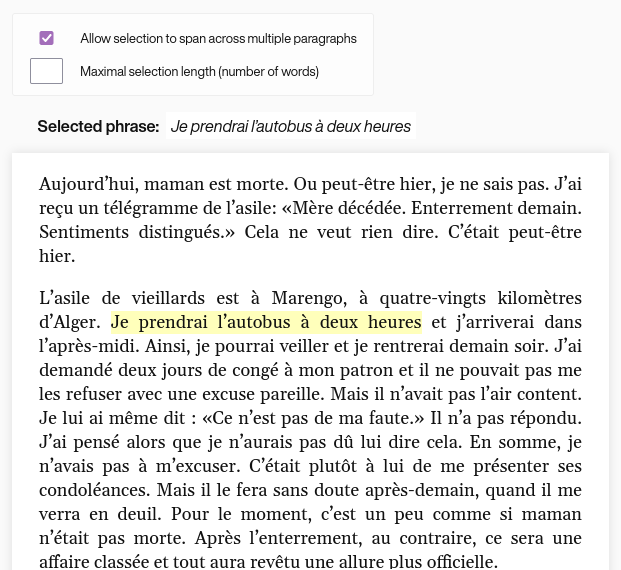

# elm-selectable-text

A selectable text component in Elm.

See the [basic usage example][example] and the [live demo][demo].

**This project was retired in 2016.**

  

[example]: https://github.com/fauu/elm-selectable-text/tree/master/examples/basic
[demo]: http://fauu.github.io/elm-selectable-text
